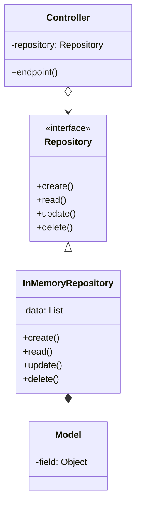

# Fawry Clone

## Table of contents

- [Project Overview](#project-overview)
    - [Normal user](#normal-user)
    - [Admin](#admin)
    - [Features](#features)
- [Technical details](#technical-details)
- [Important Notes](#important-notes)
    - [Initial service providers](#initial-service-providers)
    - [Adding a new service provider](#adding-a-new-service-provider)
    - [Authentication](#authentication)
    - [Bypassing authentication to facilitate testing](#bypassing-authentication-to-facilitate-testing)
    - [Protected endpoints](#protected-endpoints)

### Project overview

This project is a clone of the Fawry system that allows users to pay
for different services.

There are two types of users who can use this system:

1. Normal user
2. Admin

#### Normal user

This user can pay for the services provided by the different
service providers in the system. They have a wallet which they
can use in payment, and they can issue refund requests
for payment transactions they make.

#### Admin

This user can respond to refund requests made by normal users,
they can add discounts to the available services, and see
all transactions made by normal users.

#### Features

1. Users and admins can sign up using an email, a username
   and a password.
2. Users can search for service providers.
3. Users can pay for services.
4. Users can make refund requests.
5. Users can add funds to their wallet.
6. Admins can add discounts to services.
7. Admins can see all transactions made by normal users.
8. Admins can respond to refund requests made by normal users.

### Technical details

The whole system is divided into 7 main subsystems:

- The authentication subsystem
- The payment subsystem
- The service providers subsystem
- The refunds subsystem
- The wallet subsystem
- The discounts subsystem
- The transactions subsystem

Each subsystem has one minimal and clear goal that it
achieves by exposing its functionality through a bunch of
REST endpoints.

Each subsystem is contained in a package designed
in the following manner:



The package ```common``` as its name suggests contains
all classes used by multiple controllers, such as exception
and exception handling classes,
and the input validation class ```Validator```.

### Important notes

#### Initial service providers

Initially, there are 3 service providers:
  - WE
  - Vodafone
  - Etisalat

For every service, no matter it's type (e.g. donation, landline, etc.)
there will be a concrete 
class that _extends_ the ```ServiceProvider``` abstract class
and declares all the inputs it needs to provide its services.

#### Adding a new service provider

A developer can easily add a new service provider
by following the simple steps below:

1. Go to the package ```eg.edu.cu.fcai.swe.fawry.provider.providers```.
2. Create a new class for the new provider to be added.
3. Make the provider class _extend_ the ```ServiceProvider``` class.
4. Create a constructor that takes the following parameters:
    - ```String id```
    - ```String name```

and pass them to the ```super(String id, String name)``` constructor call.

The ```id``` should be unique across all service providers.

The ```name``` is the service name that end users will see when
they are searching for service providers.

5. Implement the ```boolean handle(Map<String, Object> paymentForm)```
   method.

Put all checks on the required form fields
(found in ```paymentForm```) here, and of course,
the calls to the service provider's API.

#### Authentication

- This system implements an **actual authentication
  system**, so when you create a user or admin account
  you will get a token in return (in the response body)
  that you will have to put in the **Authorization** header
  of requests to protected endpoints.


- The value of the Authorization header should follow this format:

```
Bearer <TOKEN>
```

where ```<TOKEN>``` is the actual token string returned from the sign-up/in endpoint.

#### Bypassing authentication to facilitate testing

- If you want to bypass token validation, there is
  a **dummy user account** and a **dummy admin account** created
  initially that you can use by turning on _**debug mode**_.

To turn on debug mode, follow these simple steps:

1. Go to the class ```eg.edu.cu.fcai.swe.fawry.common.Validator```

2. Find this line:

```
private static final boolean DEBUG_MODE = false;
```

3. Change the value of ```DEBUG_MODE``` to ```true```.

Now, you should be able to access all endpoints without the need
to create user or admin accounts.

#### Protected endpoints

- The following endpoints are protected,
  which means you need to be an authenticated
  user or admin to access them.

If the
[previously mentioned](#bypassing-authentication-to-facilitate-testing)
```DEBUG_MODE``` is set to ```false``` you will,
need to be an authenticated admin to access the following
endpoints:

```
POST /discount/{{providerId}}
```

```
POST /discount
```

```
GET  /refund/all
```

```
POST /refund/response
```

```
GET  /transaction/all
```

and an authenticated user to access the following endpoints:

```
POST /pay/{{providerId}}
```

```
GET  /wallet
```

```
POST /wallet
```

```
GET  /refund/request
```

```
POST /refund/request
```

```
GET  /transaction
```
